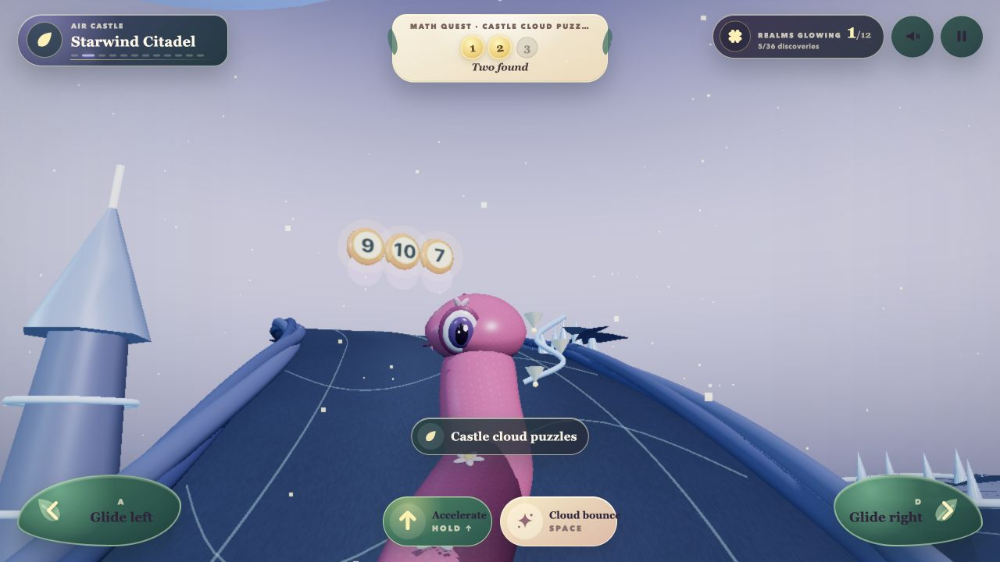
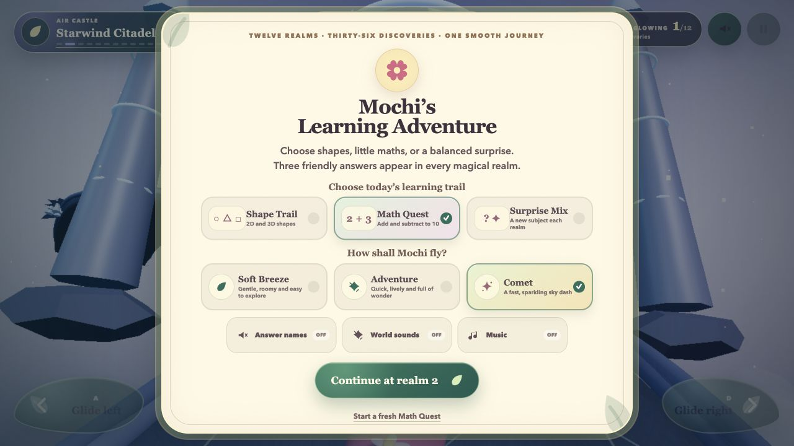

<div align="center">

# 🌸 Mochi’s Cloudglow Learning Adventure

### A cinematic 3D snake-coaster where early learners steer through shapes, small maths, and twelve magical worlds.

[](https://mochi-cloudglow-adventure.vercel.app/)


</div>



Mochi is a pink, chubby snake with a wonderfully serious job: carry a young learner through a continuous fantasy adventure without making learning feel like a worksheet.

The child answers by **moving through the world**. Three large paths hold possible answers; steering Mochi toward one turns recognition, prediction, and simple calculation into physical play. There is no timer, game over, lost progress, or harsh correction.

## Why this works for early learners

| Design choice | Learning value |
| --- | --- |
| **Learning is part of movement** | The child answers by steering, so each idea is connected to action and spatial memory. |
| **Questions change every journey** | Targets, distractors, lane positions, and maths values are seeded and reshuffled instead of appearing in a fixed order. |
| **Challenge without pressure** | A wrong path creates a friendly retry moment. There is no score loss, countdown, or negative voice feedback. |
| **Instructions stay visual** | Prompts are compact and on-screen. Optional speech names the correct shape or answer only after it is collected. |
| **Difficulty grows gently** | Familiar ideas sit beside advanced shapes and 3D forms; maths stays within addition and subtraction to 10. |
| **Small hands get big controls** | Left, right, accelerate, and Cloud Bounce are available as large touch targets and simple keyboard controls. |
| **The journey remembers** | Progress, learning mode, speed, and sound preferences are saved locally so a child can continue later. |

## Three learning journeys



### Shape Trail

Twenty-five 2D and 3D shapes are organised into three overlapping levels, so recognisable shapes build confidence while unusual shapes keep the journey elevated.

- **Familiar:** circle, triangle, square, rectangle, oval, star, heart, semicircle
- **Advanced:** pentagon, hexagon, octagon, trapezium, parallelogram, kite, crescent, rhombus
- **Explorer:** heptagon, nonagon, decagon, sphere, cube, cone, cylinder, pyramid, triangular prism

Every shape realm draws one target from each level, randomises its two distractors, and shuffles all three answer lanes. The third discovery becomes an expressive **Sky Reach**, encouraging the child to recognise the shape in a different physical context.

### Math Quest

Math questions use only **addition and subtraction with answers from 0 to 10**. Problems and answer positions are generated afresh for each journey, with three possible paths and no penalty for experimenting.

### Surprise Mix

Shapes and maths are distributed across all twelve realms using balanced rotating patterns. Neither subject is permanently backloaded, and a new journey can begin with a different learning rhythm.

## A snake that feels alive

Mochi is not a rigid chain of balls. Her body is a continuously deforming tube driven by a procedural, follow-the-leader spine:

- **32 remembered spine stations** carry the route taken by her head toward the tail.
- Lane changes ripple naturally backward instead of moving every segment at once.
- Compression and stretch waves create a soft peristaltic feel while preserving body volume.
- Each realm has its own motion profile: buoyant underwater drift, tighter jungle movement, airy Citadel gliding, low-gravity space travel, and more.
- Head stabilisation keeps her expressive face readable while the body moves beneath it.
- Cloud Bounce and Sky Reach layer authored coils and upright motion over the normal locomotion without breaking the route history.

The third-person camera also follows the physical journey rather than locking Mochi to a lifeless centre point. It anticipates curves, follows lane movement smoothly, and allows a small natural composition drift while keeping the character safely visible.

## Twelve worlds, one smooth journey

There are no midpoint menus interrupting play. The world changes continuously as Mochi travels through:

| 1–4 | 5–8 | 9–12 |
| --- | --- | --- |
| Cloudglow Garden | Sunbeam Prism Desert | Candy Cloud Carnival |
| Starwind Citadel | Clockwork Toy Town | Melody Mountain |
| Lantern Reef | Aurora Snowglobe | Bubble Planet Spaceport |
| Moonvine Wilds | Dinosaur Fern Valley | Storybook Harbor |

Each realm contains three discoveries, distinct landmarks, friendly obstacles, a colour story, a movement profile, and its own procedural sound palette: **36 learning moments in one continuous adventure**.

## Gentle by design

- No game over, lives, timer, leaderboard, or lost progress
- Wrong answers lead to a calm retry path and optional visual assistance
- Friendly obstacles create a soft poof and brief slowdown—not failure
- Large, persistent controls for desktop and mobile landscape
- Separate toggles for answer names, world sounds, and music
- Upbeat procedural music that ducks beneath spoken learning feedback
- No sign-in or child profile required

## Controls

| Action | Keyboard | Touch |
| --- | --- | --- |
| Glide left | `A` or `←` | **Glide left** |
| Glide right | `D` or `→` | **Glide right** |
| Accelerate | Hold `↑` | Hold **Accelerate** |
| Cloud Bounce / Sky Reach | `Space` | **Cloud Bounce** |

Parents can choose **Soft Breeze**, **Adventure**, or **Comet** before play. Holding accelerate adds a temporary burst without changing the selected base pace.

## Sound with purpose

The soundtrack is generated in the browser with the Web Audio API. Each realm blends its own melody, bass, ambience, percussion, and transition treatment into an upbeat continuous score.

Spoken learning feedback is intentionally restrained: the game does not read mechanical instructions aloud. When enabled, it simply names a collected shape or answer, while music and ambience duck gently underneath.

## Built with

- TypeScript, React, and Vite
- Three.js through React Three Fiber and Drei
- Procedural geometry, materials, lighting, particles, and animation
- Web Audio API for music, ambience, interaction sounds, and optional answer naming
- Responsive CSS for desktop and mobile-landscape controls
- Vercel for the live production build

## Run locally

```bash
npm install
npm run dev
```

Open the URL printed by Vite (normally `http://127.0.0.1:5188/`).

Create a production build:

```bash
npm run build
```

## Contributing without changing the original

This repository is the canonical version maintained by `@limchinhan123`. Contributors do not need direct write access: **fork the repository, create a branch in the fork, then open a pull request into `main`**.

The owner reviews every proposed change before it can become part of the original game. See [CONTRIBUTING.md](CONTRIBUTING.md) for the child-safety, privacy, testing and visual-quality requirements.

## Quality standard

A technically functional build is not enough. Every realm, learning interaction, control, camera path, and responsive layout is reviewed against [VISUAL_ACCEPTANCE.md](VISUAL_ACCEPTANCE.md).

> **Design principle:** education should deepen the adventure, never pause it or make a young child feel tested.
